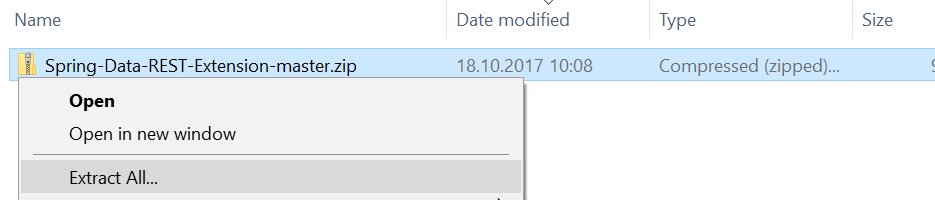
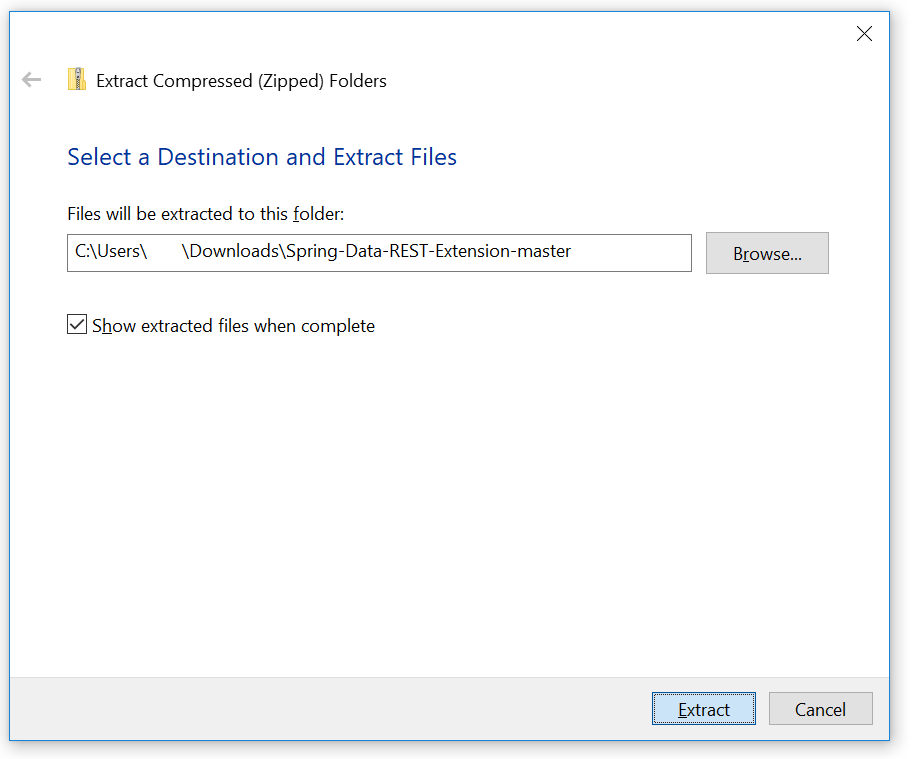
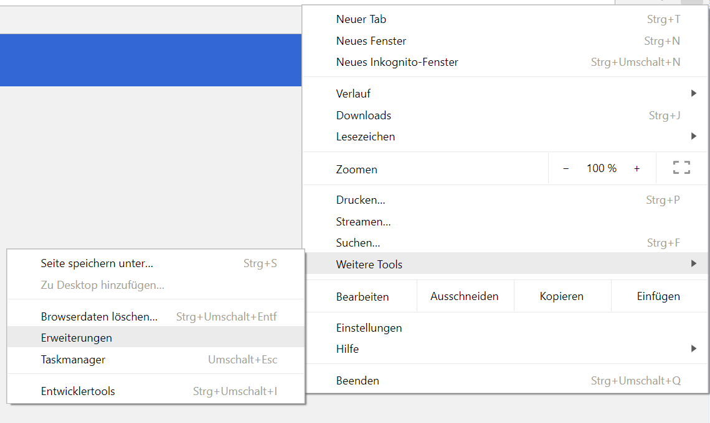
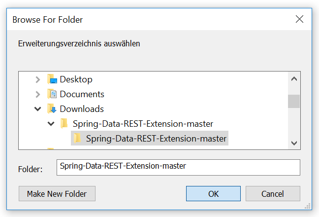

# Spring Data REST extension (chrome)

## Installation instruction

1. Download the ZIP File 
2. Rightclick on the ZIP File and choose extractall (remember the path) 
3. Extract all 
4. Open Chrome
5. Click on the three dots 
6. Choose extensions 
7. Load from unpacked, select the path from step 2 

Ready
